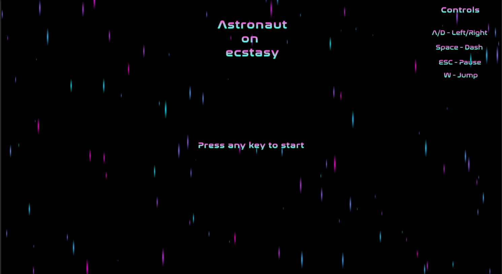
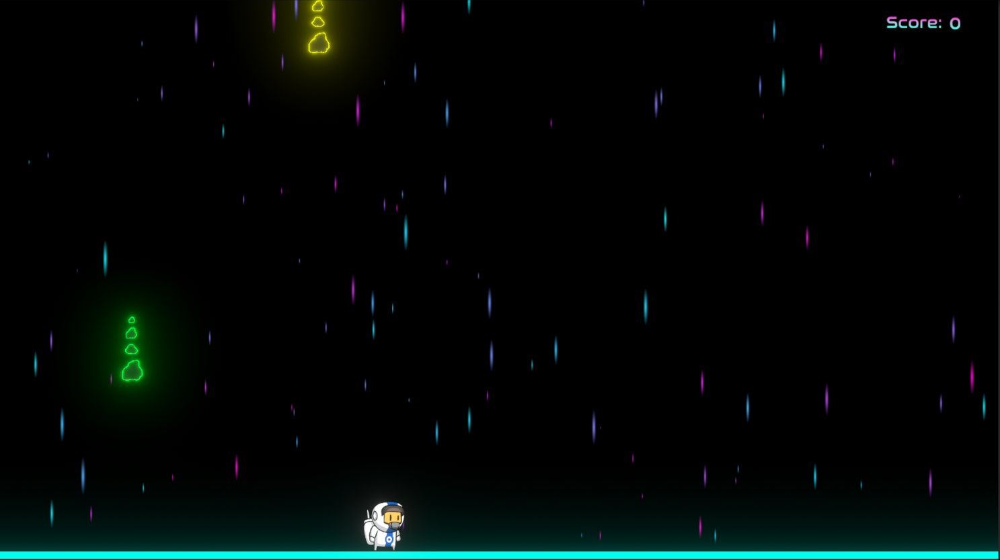
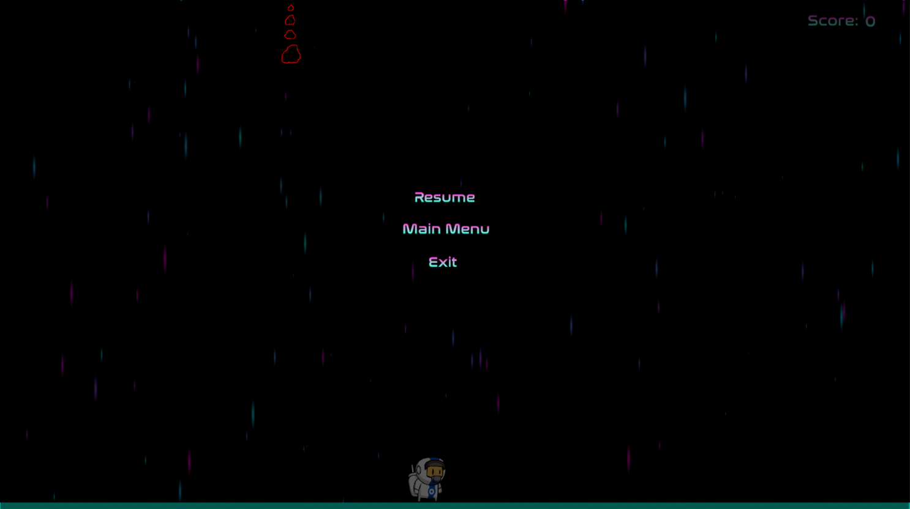

# WORK IN PROGRESS!
## Astronaut on ecstasy

## Description
**Simple 2D jumper game where you play as astronaut and your job is to destoy as much falling asteroids you can.**

## Functions 
* Movement (A -> Left, D -> Right, W -> Jump, Space -> Dash)
* ESC -> Pause

## Gameplay
* Move, jump and use dash to destroy falling asteroids
* If you hit asteroid without dashing into it you will lose point
* If asteroids fall to the ground you will lose point

## TODO
* Add abilities (special powers like shield, magnet, electric floor)
* Add more falling object types
* Add life count and/or remaining time
* Improve design
* Implement game over condition

## Requirements 
* Unity ([Download](https://unity.com/download))
* Script editor of your choice

## Get it running
1. Set up Unity
2. Clone this repository `git clone https://github.com/Topesa/AstronautOnEcstasy`
3. Open project with Unity

## Application building
1. `File` -> `Build Settings` -> `Select target platform and architecture` -> `Build`
2. Have fun 

## Screenshots
### Main Menu 

### Gameplay

### Pause

